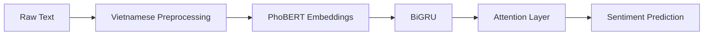

# 🔥 VietEduSent: A Production-Ready NLP Framework for Vietnamese Sentiment Analysis (97.45% Accuracy)

[](https://huggingface.co/spaces/hautm/VietEduSent-Demo)
[](https://huggingface.co/datasets/uit-nlp/vietnamese_students_feedback)
[](https://www.python.org/)
[](https://keras.io/)
[](https://opensource.org/licenses/MIT)

> 🚀 A production-ready NLP system that **automatically analyzes Vietnamese student feedback**, delivering **97.45% accuracy** and actionable insights for educational improvement.

---

## 🎥 Live Demo

👉 Try it instantly:
🔗 https://huggingface.co/spaces/hautm/VietEduSent-Demo

**Example:**

```
Input:  "Giảng viên dạy rất hay, nhiệt tình, support sinh viên tới bến!"
Output: 🟢 Positive (0.98)
```

> ⚡ Real-time inference powered by PhoBERT + BiGRU + Attention

---

## 🌍 Why This Matters

Educational institutions receive **thousands of unstructured feedback comments** every semester.

VietEduSent transforms this raw data into **actionable intelligence**:

* ⚡ **Automates feedback analysis** at scale
* ⏱️ **Reduces manual review time by >90%**
* 📊 **Identifies teaching quality trends instantly**
* 🌏 **Optimized for Vietnamese (low-resource NLP)**

---

## ⚡ Quick Start

### 1. Clone repository

```bash
git clone https://huggingface.co/spaces/hautm/VietEduSent-Demo
cd VietEduSent-Demo
```

### 2. Install dependencies

```bash
pip install -r requirements.txt
```

### 3. Run app

```bash
python app.py
```

👉 Open: http://localhost:7861

---

## 🧠 Model Architecture



### 🔍 Why not just PhoBERT?

| Model         | Limitation                     |
| ------------- | ------------------------------ |
| PhoBERT       | Misses sequential dependencies |
| RNN           | Weak contextual understanding  |
| ✅ VietEduSent | Combines both + attention      |

👉 Result: **+0.75% accuracy improvement** over strong PhoBERT baseline

---

## 📊 Dataset Insights

* 📦 Dataset: UIT-VSFC (16,000+ samples)
* ⚠️ Severe imbalance:

  * Positive: ~49.7%
  * Negative: ~46.0%
  * Neutral: ~4.3%

👉 Standard models fail on Neutral class → VietEduSent solves this via **Class-Balanced Focal Loss**

---

## 🚀 Key Innovations

* 🧠 **Hybrid Architecture:** PhoBERT + BiGRU + Attention
* ⚖️ **Class Imbalance Handling:** Class-Balanced Focal Loss
* 🇻🇳 **Vietnamese NLP Pipeline:**

  * Teencode normalization
  * Emoji handling
  * Word segmentation (underthesea)
* ⚡ **Production Deployment:** Hugging Face Spaces + Gradio

---

## 🏆 Performance

| Model                      |   Accuracy |   Macro F1 |
| -------------------------- | ---------: | ---------: |
| PhoBERT (baseline)         |     96.70% |          — |
| **VietEduSent (proposed)** | **97.45%** | **97.38%** |

> 📈 Statistically significant improvement (p < 0.01)

---

## 📁 Project Structure

```
VietEduSent/
├── app.py
├── preprocessing/
├── models/
├── notebooks/
├── requirements.txt
└── README.md
```

---

## ⚙️ Tech Stack

* 🤗 Transformers (PhoBERT)
* TensorFlow / Keras
* Underthesea (Vietnamese NLP)
* Scikit-learn
* Gradio (deployment)

---

## 📌 Use Cases

* 🎓 University feedback analytics dashboards
* 📚 EdTech platforms
* 📊 Course quality monitoring systems
* 🧠 Vietnamese NLP research

---

## 🤝 Authors

**Tran Minh Hau & Le Van Hiep**
Advisor: Dr. Duy-Nguyen Vo Le
University of Information Technology — VNU-HCM

